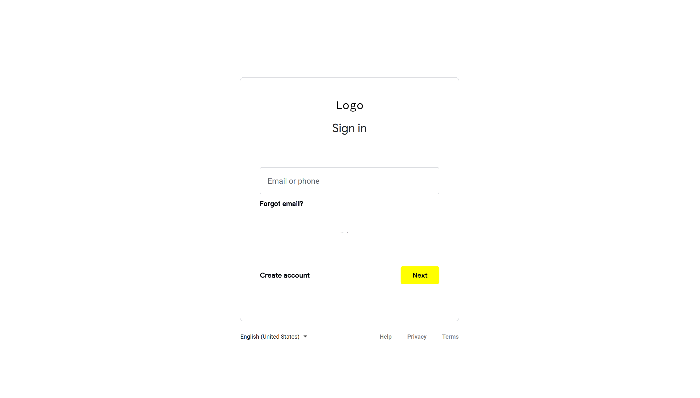

# Screen Design

### Attribution
* Paula Waite (Inspiration from Fat Bike Trail Reports)
* Google (Inspiration from Gmail)
* Microsoft (Utilization of Microsoft Whiteboard)
* Materialize (Utilization of Materialize modern responsive CSS framework 
  based on Material Design by Google)
* Adobe (Utilization of Adobe Photoshop)
##### Thank you; I appreciate you, the resource utility, and the inspiration. 🙏🙏🙏

### Index 0.1

### Index 0.2

### Sign Up 0.1

### Sign In 0.1

